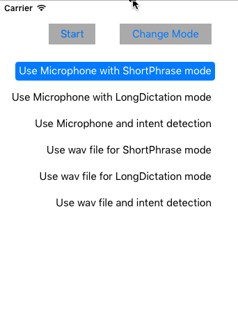

# Microsoft Bing Speech API: iOS Speech-to-Text Client Library & Sample
This repo contains iOS samples for using Speech-to-Text in the Microsoft Bing Speech API, an offering within [Microsoft Cognitive Services](https://www.microsoft.com/cognitive-services), formerly known as Project Oxford.
* [Learn about the Bing Speech API](https://www.microsoft.com/cognitive-services/en-us/speech-api)
* [Read the documentation](https://www.microsoft.com/cognitive-services/en-us/speech-api/documentation/overview)
* [Find more SDKs & Samples](https://www.microsoft.com/cognitive-services/en-us/SDK-Sample?api=bing%20speech)

## The Client Library
The client library is a client library for Speech-to-Text in the Microsoft Bing Speech API

To add the client library dependency from an existing XCode Project:
 1. Select your target application, and open the menu `File` then `Add Files to ...`

 2. Navigate to `Speech > SpeechToText > iOS > iPhoneOS`, select `SpeechSDK.framework`, and click `Add`.

 3. Go to your project settings, by single clicking your project, and navigate to the `General` tab.  You'll notice that SpeechSDK.framework exists under the `Linked Frameworks and Libraries` section.

 4. In the General tab, under the `Embedded Binaries` section, click the (+) button.   In the dialog, select `SpeechSDK.framework` and click the `Add` button.

 5. If you wish to run on the iOS Simulator or MacOSX, repeat steps 2-4 but choose either `iPhoneSimulator` or `MacOSX` instead.

## The Sample
This sample demonstrates the following features using a wav file or external microphone input:
 * Short-form recognition
 * Long-form dictation
 * Recognition with intent

### Build the sample
 1. First, you must obtain a Speech API subscription key by [following the instructions on our website(<https://www.microsoft.com/cognitive-services/en-us/sign-up>).

 2. Start XCode and choose the menu `File`, and `Open...` the workspace file `Speech > SpeechToText > iOS > SpeechSDK.xcworkspace`.

 3. In XCode, select menu `Product > Build` to build the sample,
    and `Run` to launch this sample app.

### Running the sample
In XCode, select the menu `Product`, and `Run` to launch this sample app.

 1. In the application, press the button `Change Mode` to select what type of Speech would like to use.

 2. For modes where you would like both Speech recognition and Intent to work, you need to sign up [Language Understanding Intelligent Service (LUIS)](<https://www.microsoft.com/cognitive-services/en-us/sign-up>) and set the key values in
    luisAppID and luisSubscriptionID from `Samples\_SpeechRecognitionServerExample\_settings.plist`.

 3. To Start recognition, press the Start button.

## Contributing
We welcome contributions. Feel free to file issues and pull requests on the repo and we'll address them as we can. Learn more about how you can help on our [Contribution Rules & Guidelines](</CONTRIBUTING.md>). 

You can reach out to us anytime with questions and suggestions using our communities below:
 - **Support questions:** [StackOverflow](<https://stackoverflow.com/questions/tagged/microsoft-cognitive>)
 - **Feedback & feature requests:** [Cognitive Services UserVoice Forum](<https://cognitive.uservoice.com>)

This project has adopted the [Microsoft Open Source Code of Conduct](https://opensource.microsoft.com/codeofconduct/). For more information see the [Code of Conduct FAQ](https://opensource.microsoft.com/codeofconduct/faq/) or contact [opencode@microsoft.com](mailto:opencode@microsoft.com) with any additional questions or comments.

## License
All Microsoft Cognitive Services SDKs and samples are licensed with the MIT License. For more details, see
[LICENSE](</LICENSE.md>).

Sample images are licensed separately, please refer to [LICENSE-IMAGE](</LICENSE-IMAGE.md>).

## Developer Code of Conduct
Developers using Cognitive Services, including this client library & sample, are expected to follow the “Developer Code of Conduct for Microsoft Cognitive Services”, found at [http://go.microsoft.com/fwlink/?LinkId=698895](http://go.microsoft.com/fwlink/?LinkId=698895).
